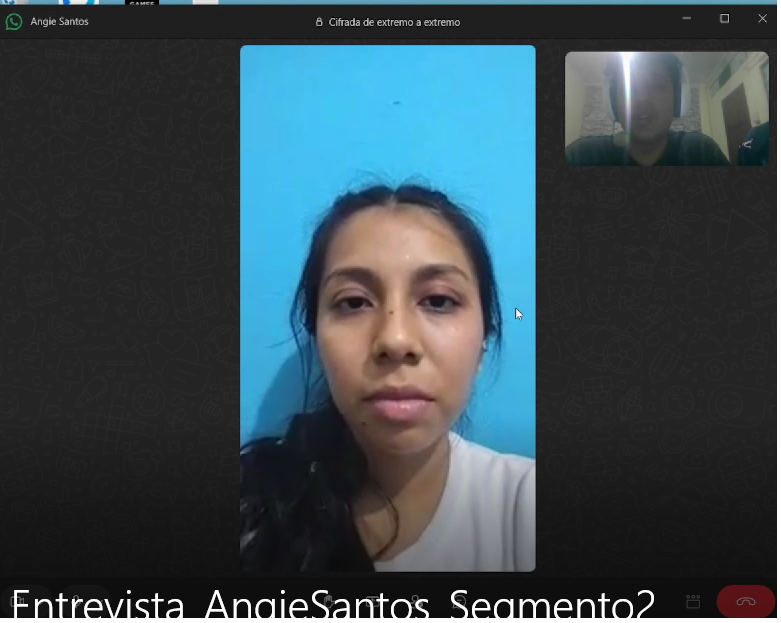
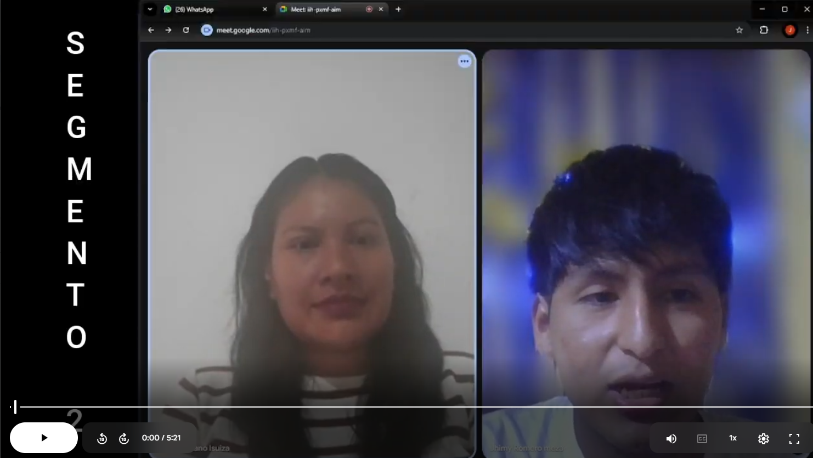
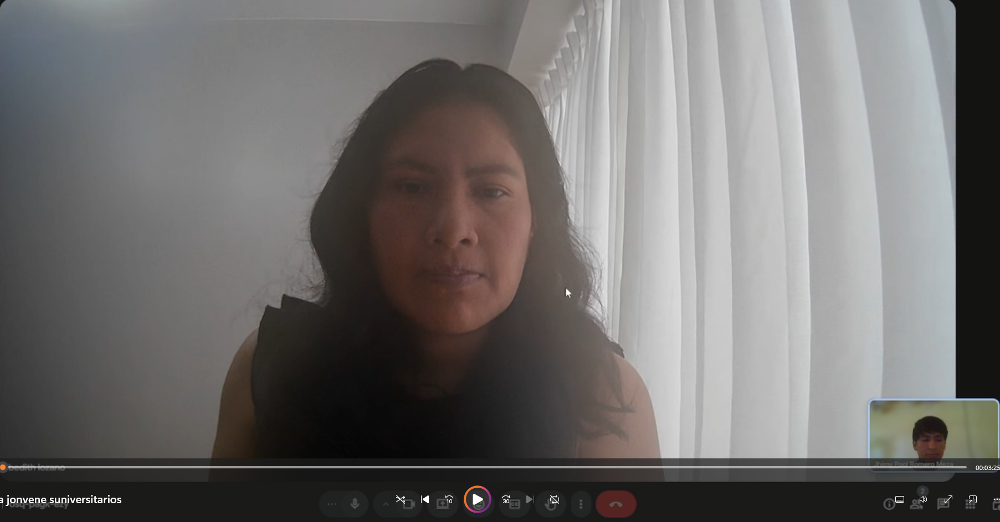
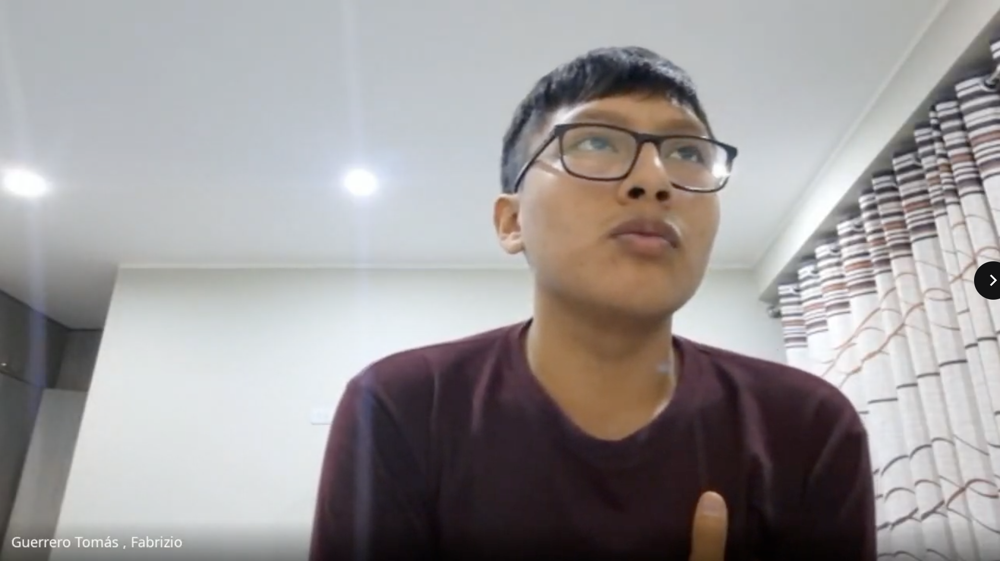

# Capítulo II: Requirements Elicitation & Analysis
## 2.1. Competidores.
### 2.1.1. Análisis competitivo

#### Competitive Analysis Landscape

**¿Por qué llevar a cabo este análisis?**

Comparar ICHU IoT con sus principales competidores para identificar fortalezas, debilidades, oportunidades y amenazas, y determinar una ventaja competitiva clara y sostenible en el mercado de monitoreo inteligente de ganado.

| Sección | Criterio | ICHU IoT | Allflex SenseHub | Digitanimal | Moocall |
|---|---|---|---|---|---|
| **Perfil** | **Overview** | Solución digital basada en collares y aretes inteligentes IoT con conectividad LoRaWAN y celular híbrida, integrada a una plataforma web y móvil nativa para el monitoreo biométrico y localización en tiempo real de ganado en pastoreo extensivo. | Líder global en identificación animal y monitoreo inteligente de ganado lechero y de carne, perteneciente al grupo MSD Animal Health, con infraestructura propietaria robusta. | Empresa de base tecnológica española que ofrece collares GPS y sensores para el monitoreo de la ubicación, temperatura y comportamiento de animales en pastoreo extensivo. | Compañía irlandesa especializada en dispositivos IoT acoplados a la cola del animal para la detección temprana del parto y collares para el monitoreo de celo. |
| **Perfil** | **Ventaja competitiva** | Conectividad híbrida adaptable (LoRaWAN/red celular) con modo offline para sincronización retrasada; algoritmos locales de bajo consumo; costo accesible sin necesidad de costosas antenas propietarias locales en cada rancho ganadero. | Monitoreo biométrico de alta precisión (rumia, estrés por calor y celo) respaldado por investigación veterinaria y validación clínica a nivel industrial. | Alta durabilidad del dispositivo GPS, geocercas de precisión y mapeo visual avanzado de rutas de pastoreo. | Especialización en parto y celo con alertas directas por SMS y alta orientación preventiva en ganado gestante. |
| **Perfil de Marketing** | **Mercado objetivo** | Medianos y grandes productores ganaderos en América Latina con ganado de carne y doble propósito bajo esquemas de pastoreo extensivo o semi-intensivo. | Grandes productores de ganado lechero e industrial de alta producción bajo confinamiento o pastoreo intensivo. | Ganaderos de montaña o pastoreo extensivo en Europa y América Latina que requieren seguimiento de ubicación. | Criadores de ganado vacuno enfocados en reproducción y mejora genética, especialmente durante la época de parición. |
| **Perfil de Marketing** | **Estrategias de marketing** | Demostraciones prácticas en asociaciones ganaderas locales, marketing digital enfocado en ahorro de mano de obra y reducción de pérdidas, y alianzas con veterinarias locales. | Venta consultiva corporativa, presencia en ferias agropecuarias internacionales y marketing científico respaldado por veterinarios. | Marketing de contenidos enfocado en localización y recuperación de animales, acompañado de casos de éxito. | Publicidad de nicho en reproducción bovina, demostraciones de uso y distribución mediante veterinarias aliadas. |
| **Perfil de Producto** | **Productos y servicios** | Arete y collar inteligente con acelerómetro y sensor de temperatura; aplicación móvil Android/iOS; plataforma web de gestión analítica; API RESTful para servicios veterinarios. | Collares y aretes inteligentes SenseHub, antenas receptoras propietarias, software SaaS y aplicación móvil de alertas. | Collares GPS con sensores de temperatura, plataforma web cartográfica y aplicaciones móviles de rastreo y geocercas. | Sensor Moocall Calving, collar Moocall HEAT, servicio SaaS de alertas por SMS y aplicación móvil. |
| **Perfil de Producto** | **Precios y costos** | Dispositivos de adquisición única y plan de suscripción mensual flexible según la escala de ganado. | Hardware e instalación de mayor costo y licenciamiento SaaS anual. | Costo moderado por dispositivo y suscripción anual asociada a la conectividad. | Costo por sensor y cuota anual de servicio para alertas móviles. |
| **Perfil de Producto** | **Canales de distribución** | Landing Page con e-commerce, distribuidores regionales de insumos agropecuarios y tiendas oficiales de aplicaciones móviles. | Distribuidores autorizados de MSD Animal Health y representantes de ventas técnicas. | Sitio web con tienda en línea, envíos internacionales y alianzas con redes de telecomunicaciones IoT. | Tienda en línea oficial, marketplaces especializados y cooperativas ganaderas. |
| **Análisis SWOT** | **Fortalezas** | Conectividad híbrida LoRaWAN/celular de bajo consumo, soporte offline, arquitectura de microservicios e integración mediante API RESTful. | Respaldo corporativo, algoritmos biométricos probados y red de soporte técnico. | Dispositivos resistentes y posicionamiento en mercados de habla hispana. | Solución especializada y sencilla para monitoreo reproductivo. |
| **Análisis SWOT** | **Debilidades** | Marca nueva, presupuesto inicial de marketing limitado y dependencia de la capacidad de ensamblaje de dispositivos físicos. | Inversión elevada y necesidad de infraestructura propietaria en ciertos escenarios. | Consumo de batería asociado al uso intensivo de GPS y menor integración con servicios veterinarios locales. | Alcance funcional limitado fuera del monitoreo reproductivo. |
| **Análisis SWOT** | **Oportunidades** | Digitalización del sector ganadero latinoamericano, necesidad de reducir pérdidas y mayor disponibilidad de redes IoT de largo alcance. | Crecimiento de ganaderías intensivas de alta eficiencia. | Expansión de redes NB-IoT y otras tecnologías de conectividad de bajo consumo. | Alianzas con proveedores de genética y reproducción bovina. |
| **Análisis SWOT** | **Amenazas** | Variación del precio de componentes electrónicos e ingreso de competidores de hardware de bajo costo. | Aparición de soluciones abiertas o sensores genéricos integrables. | Nuevas startups locales con tarifas flexibles y soporte regional. | Sustitución por collares biométricos capaces de predecir eventos reproductivos con menor costo. |

### 2.1.2. Estrategias y tácticas frente a competidores

Para posicionar a ICHU IoT con éxito, nuestra startup implementará un conjunto de estrategias y tácticas comerciales y de ingeniería de software orientadas a contrarrestar las fortalezas de los competidores establecidos y capitalizar sus debilidades en el contexto ganadero latinoamericano:

**Estrategia 1:** Reducción de Barreras Económicas y Tecnológicas de Infraestructura
Táctica Comercial: Eliminar la necesidad de costosas antenas fijas propietarias en el rancho ganadero (la gran debilidad de Allflex). El ganadero podrá optar por aretes inteligentes que transmiten de forma local a un único collar maestro (que actúa como dispositivo gateway en el animal líder de la manada), reduciendo a una fracción los costos de instalación física.
Táctica de Ingeniería: Diseñar el collar inteligente con conectividad híbrida que almacene la telemetría en memoria flash local cuando el ganado se encuentre en "zonas ciegas" sin señal. Una vez que el ganado retorne a áreas de cobertura o se aproxime al corral principal, los datos se sincronizarán de forma transparente y asíncrona hacia nuestro Edge API.

**Estrategia 2:** Optimización Energética de los Dispositivos Físicos
Táctica Comercial: Promocionar una vida útil de la batería de los aretes y collares de hasta 3 años, reduciendo drásticamente las horas de mano de obra asociadas al cambio de baterías y manipulación estresante del ganado (superando la debilidad de Digitanimal).
Táctica de Ingeniería: Implementar en los dispositivos embebidos un algoritmo inteligente de transmisión dinámica. Si el ganado se encuentra en reposo (determinado por el acelerómetro local), el módulo GPS/transmisor entra en modo de ultra bajo consumo (Deep Sleep), transmitiendo únicamente cuando se detecten patrones de actividad inusual, geocofencing cruzado o anomalías térmicas en el animal.

**Estrategia 3:** Flexibilidad de Suscripción y Monetización Adaptativa
Táctica Comercial: Ofrecer un modelo de negocio SaaS con planes escalables basados en el tamaño real de la unidad ganadera (por cabeza de ganado), permitiendo a los medianos productores adoptar la tecnología de forma incremental. Esto contrasta directamente con los planes de pago anuales rígidos e inaccesibles de Allflex y Digitanimal.
Táctica de Ingeniería: Implementar en nuestro backend de servicios web un módulo dinámico de suscripciones y facturación asimilado por el microservicio correspondiente, permitiendo habilitar o deshabilitar de forma automática características del software (como reportes avanzados o alertas SMS críticas) basándose en el plan activo del usuario.

**Estrategia 4:** Integración del Ecosistema de Salud mediante API RESTful de Desarrollo Interno
Táctica Comercial: Posicionar a ICHU IoT no solo como un rastreador o un sensor aislado, sino como una plataforma abierta que conecta al ganadero con su médico veterinario de confianza. El veterinario podrá visualizar análisis clínicos e históricos de salud de manera remota para prescribir tratamientos oportunos, reduciendo las visitas físicas improductivas.
Táctica de Ingeniería: Diseñar y documentar rigurosamente los endpoints de nuestro RESTful API con OpenAPI/Swagger, permitiendo que sistemas externos de laboratorios o software de gestión de terceros se integren de forma segura mediante protocolos estandarizados, expandiendo el valor del ecosistema sin comprometer la seguridad de la información.

## 2.2. Entrevistas
### 2.2.1. Diseño de entrevistas
A continuación, se presenta la relación de preguntas principales y complementarias estructuradas para cada uno de los tres segmentos objetivo identificados. El cuestionario recopila tanto la información demográfica y de perfil requerida para construir los User Personas (arquetipos) como la información operativa y de dolor para mapear los requisitos de software del sistema.

**Segmento 1:** Medianos y Grandes Ganaderos (Propietarios y Administradores de Estancias)
Este segmento representa al comprador principal (Buyer Persona) y tomador de decisiones financieras de la estancia. El objetivo es identificar la viabilidad de la plataforma web administrativa, el modelo de suscripción SaaS y los indicadores clave (KPIs) de productividad que desean ver en pantalla .

**A. Datos Demográficos y de Perfil (Información Complementaria)**
1. ¿Cuál es su nombre, edad, nivel de instrucción y en qué distrito/región se encuentra su estancia ganadera?
2. ¿Cuántas personas conforman su familia y de qué manera participan en el negocio ganadero?
3. ¿Cuál es su ocupación o rol principal en el día a día del rancho ganadero?
4. ¿Qué dispositivos digitales prefiere utilizar en su rutina diaria (computadora de escritorio, laptop, tablet, teléfono inteligente)?
5. ¿Qué canales digitales y redes sociales utiliza con mayor frecuencia para comunicarse o informarse sobre temas ganaderos?
6. ¿Cuáles son sus marcas e influencias tecnológicas preferidas (ej. marcas de celulares, herramientas de gestión)?  
   **B. Preguntas de Comportamiento e Infraestructura**
7. ¿Cuántas cabezas de ganado maneja actualmente en su unidad productiva y bajo qué régimen (pastoreo extensivo, estabulado o semi-intensivo)?
8. ¿Qué herramientas o sistemas de software utiliza actualmente para llevar el control del inventario de animales, partos, muertes e historial médico?
9. ¿Cómo es el estado de la conectividad a internet (red celular 3G/4G/5G, internet satelital, etc.) en la casa del rancho y en las zonas de pastoreo?  
   **C. Preguntas sobre Dolores y Frustraciones**
10. ¿Cuál ha sido la pérdida económica más significativa que ha tenido en el último año debido a enfermedades no detectadas a tiempo o muerte súbita de animales?
11. ¿Cómo le afecta el robo de ganado (abigeato) o el extravío de animales en términos de costos de búsqueda y pérdida patrimonial?
12. Al contratar consultorías veterinarias externas, ¿cuáles son los principales problemas de comunicación o falta de datos históricos que experimenta?  
    **D. Validación de la Propuesta de Software (ICHU)**
13. Si existiera una plataforma web que centralizara el historial de salud, ubicación y alertas térmicas de cada animal sin que usted tenga que estar físicamente en el corral, ¿cómo cambiaría su proceso de toma de decisiones?
14. ¿Qué información cuantitativa (gráficos de temperatura, horas de actividad, alertas de celo) consideraría indispensable visualizar en un tablero de control ejecutivo?
15. ¿Bajo qué condiciones o modelo de suscripción (ej. un pago mensual por cabeza de ganado monitoreada) consideraría rentable implementar esta solución de software en su negocio?

**Segmento 2:** Capataces y Operarios Ganaderos de Campo  
Este segmento representa al usuario operativo directo que interactuará con la aplicación móvil nativa en el terreno. El objetivo es validar la usabilidad móvil bajo condiciones climáticas adversas, el alfabetismo digital y la relevancia del sistema de alertas push/SMS en tiempo real.

**A. Datos Demográficos y de Perfil (Información Complementaria)**
1. ¿Cuál es su nombre, edad, nivel de instrucción y dónde reside actualmente?
2. ¿Cuánto tiempo lleva trabajando en el cuidado de ganado en campo abierto y cuál es su experiencia en estas tareas?
3. ¿Qué tipo de teléfono celular utiliza actualmente para su trabajo diario y de qué marca es?
4. ¿Qué aplicaciones utiliza todos los días (ej. WhatsApp, redes sociales, herramientas de clima) y qué tan cómodo se siente aprendiendo a usar nuevas aplicaciones?
5. ¿Prefiere interactuar con interfaces visuales (iconos, mapas, colores) o prefiere la lectura de textos detallados?  
   **B. Preguntas de Comportamiento y Dolores en el Campo**
6. ¿Cómo realiza el recorrido diario de pastoreo para verificar que todos los animales estén completos y sanos?
7. ¿Qué hace cuando nota que un animal no se encuentra con el grupo o se ha apartado en una zona de difícil acceso? Describa el esfuerzo físico y de tiempo que le toma encontrarlo.
8. ¿Cuál es su procedimiento cuando identifica visualmente que un bovino muestra signos de decaimiento o fiebre?
9. ¿Cómo lo registra y a quién se lo reporta?
10. ¿Qué dificultades experimenta cuando el teléfono celular pierde la cobertura de red mientras realiza labores en las zonas más alejadas del pastizal?  
    **C. Validación de la Usabilidad de la Aplicación Móvil (ICHU Mobile)**
11. Si la aplicación móvil de ICHU le permitiera ver en un mapa digital interactivo la última posición registrada de un animal extraviado, ¿cómo facilitaría esto su labor diaria de búsqueda?
12. En una zona sin señal celular, ¿qué valor tendría para usted que la aplicación móvil guarde de forma local en su teléfono las alertas y datos ingresados, para luego sincronizarlos automáticamente cuando recupere la señal?
13. Para la gestión de alertas en campo, ¿qué tipo de aviso prefiere recibir (un mensaje de texto SMS automático, una notificación push con sonido fuerte, o una alerta visual de color rojo en pantalla)?
14. ¿Qué tan simple e intuitiva debe ser la interfaz de la aplicación para que pueda registrar un evento de salud en menos de tres toques, considerando que suele estar expuesto al sol o usando guantes?

**Segmento 3:** Médicos Veterinarios y Consultores de Salud Animal  
Este segmento proporciona el sustento técnico-científico del dominio de salud. El objetivo es validar qué variables cuantitativas de telemetría biométrica (temperatura, acelerometría) requiere el veterinario para predecir anomalías de salud y cómo la API RESTful de ICHU debe estructurar los historiales clínicos para consumo de sistemas externos .

**A. Datos Demográficos y de Perfil (Información Complementaria)**
1. ¿Cuál es su nombre, especialidad médica veterinaria, años de ejercicio profesional y ámbito geográfico de atención?
2. ¿A cuántos establos o estancias ganaderas brinda consultoría o servicio médico clínico actualmente?
3. ¿Qué dispositivos informáticos y sistemas de gestión veterinaria utiliza habitualmente para registrar el  historial de tratamientos y diagnósticos?
4. ¿Cuáles son sus principales fuentes de actualización profesional y canales de comunicación digital preferidos con sus clientes?  
   **B. Preguntas de Comportamiento y dolores de Diagnóstico**
5. ¿Cuáles son los principales retos clínicos que enfrenta al diagnosticar enfermedades infecciosas comunes (ej. neumonía bovina, mastitis o problemas reproductivos) bajo esquemas de pastoreo extensivo?
6. ¿Qué tan común es que los ganaderos lo llamen para atender una emergencia médica cuando el animal ya se encuentra en una etapa clínica crítica o irreversible? ¿Cómo impacta esto en la tasa de mortalidad?
7. Al realizar un diagnóstico, ¿qué parámetros cuantitativos continuos (ej. cambios en la temperatura rectal, niveles de actividad física diaria, ciclos de rumia) desearía conocer del animal pero que actualmente le es imposible medir de forma manual?
8. ¿Cómo gestiona hoy en día los historiales de vacunación, inseminación y aplicación de medicamentos de los establos que asesora? ¿Qué tan confiables son esos registros manuales?
   **C. Validación de la Plataforma Analítica y APIs (ICHU Web/Services)**
9. Si pudiera acceder de forma remota a una plataforma web con el historial de temperatura y patrones de comportamiento de las últimas 2 semanas de un bovino reportado con alertas de decaimiento, ¿cómo optimizaría esto su diagnóstico y la prescripción de tratamientos?
10. ¿Qué gráficos cuantitativos históricos consideraría indispensables que nuestro sistema de software genere para facilitar su análisis epidemiológico a nivel de todo el lote de ganado?
11. Dado que trabajamos bajo un enfoque de ingeniería de software estructurado, ¿qué tan importante es para usted que la información recopilada por ICHU se pueda exportar en formatos estándar o integrar mediante servicios web seguros (APIs) con laboratorios clínicos o sistemas de registro oficial del Estado?

### 2.2.2. Registro de entrevistas

Se registraron nueve entrevistas semiestructuradas, tres por cada segmento objetivo. Los registros integran el perfil declarado por cada participante, la evidencia audiovisual disponible y los hallazgos que se emplearon para validar las necesidades del ecosistema ICHU.

#### Evidencia audiovisual de las entrevistas

*Figura 2.1. Evidencia audiovisual de una entrevista remota realizada para el proceso de Needfinding.*

*Figura 2.2. Evidencia audiovisual de entrevista por videollamada.*

*Figura 2.3. Evidencia audiovisual de entrevista remota con participante del estudio.*

*Figura 2.4. Evidencia audiovisual de entrevista por videollamada.*

#### Segmento 1 – Medianos y Grandes Ganaderos (Propietarios y Administradores)

| N° | Datos demográficos y perfil | Evidencia audiovisual | Resumen de respuestas y requisitos de software ICHU |
|---|---|---|---|
| **E1.1** | **Nombre:** Carlos Ugarte Vílchez **Edad:** 52 años **Residencia:** Majes-Siguas, Arequipa **Ocupación:** Administrador ganadero de 250 cabezas | Entrevista remota; duración aproximada: 14 min 45 s. | **Perfil:** pragmático y analítico. **Tecnología:** laptop Windows 11 y smartphone Samsung S23 Ultra. **Problema:** pérdida anual estimada del 4–6 % del hato por neumonía bovina detectada tardíamente y controles manuales en papel. **Validación:** requiere dashboard web con métricas térmicas en tiempo real y reportes exportables. |
| **E1.2** | **Nombre:** Carmen Rosa Benavides **Edad:** 47 años **Residencia:** Lurín, Lima; fundo en Huancayo **Ocupación:** Administradora y socia ganadera | Entrevista remota; duración aproximada: 13 min 10 s. | **Perfil:** administra parte de la operación a distancia. **Tecnología:** MacBook Pro, iPhone 15 Pro Max e iPad Pro. **Problema:** falta de trazabilidad de vacunación y peso; dificultad para auditar actividades de campo. **Validación:** valora roles y permisos para restringir la información según el tipo de usuario. |
| **E1.3** | **Nombre:** Fernando Pflucker **Edad:** 58 años **Residencia:** Baños del Inca, Cajamarca **Ocupación:** Empresario agropecuario | Entrevista remota; duración aproximada: 12 min 15 s. | **Perfil:** conservador y preocupado por la seguridad en colindancias. **Tecnología:** PC Windows 10 y smartphone Xiaomi Redmi Note 12. **Problema:** abigeato y extravío de animales; reporta la pérdida de ocho reses el último año. **Validación:** prioriza geocercas y alertas de salida de perímetro. |

#### Segmento 2 – Capataces y Operarios Ganaderos de Campo

| N° | Datos demográficos y perfil | Evidencia audiovisual | Resumen de respuestas y requisitos de software ICHU |
|---|---|---|---|
| **E2.1** | **Nombre:** Esteban Quispe Huamán **Edad:** 41 años **Residencia:** Chivay, Arequipa **Ocupación:** Capataz general de campo | Entrevista remota; duración aproximada: 11 min 40 s. | **Perfil:** operativo; pasa más de diez horas diarias en campo. **Tecnología:** smartphone Motorola Moto G54; no usa computadora para su labor diaria. **Problema:** invierte de tres a cuatro horas buscando vacas preñadas o enfermas y no cuenta con señal en quebradas. **Validación:** exige modo offline y sincronización automática al recuperar cobertura. |
| **E2.2** | **Nombre:** Mateo Condori Mamani **Edad:** 34 años **Residencia:** Mantaro, Junín **Ocupación:** Operario de pastoreo y control | Entrevista remota; duración aproximada: 10 min 25 s. | **Perfil:** abierto al uso de herramientas digitales. **Tecnología:** smartphone Samsung Galaxy A14. **Problema:** las fichas de papel se dañan por la lluvia o se extravían. **Validación:** solicita botones amplios, alto contraste para sol directo y búsqueda rápida por código de arete. |
| **E2.3** | **Nombre:** Faustino Rivas Gutiérrez **Edad:** 49 años **Residencia:** Baños del Inca, Cajamarca **Ocupación:** Vaquero y asistente de campo | Entrevista remota; duración aproximada: 9 min 50 s. | **Perfil:** tradicionalista y centrado en el cuidado del ganado. **Tecnología:** smartphone Android de gama de entrada. **Problema:** dificultad para avisar con rapidez al veterinario ante emergencias nocturnas. **Validación:** requiere alertas sonoras y código de colores claro para identificar anomalías. |

#### Segmento 3 – Médicos Veterinarios y Consultores de Salud Animal

| N° | Datos demográficos y perfil | Evidencia audiovisual | Resumen de respuestas y requisitos de software ICHU |
|---|---|---|---|
| **E3.1** | **Nombre:** Valeria Mendoza Saldaña **Edad:** 36 años **Residencia:** Arequipa **Ocupación:** Médica veterinaria consultora | Entrevista remota; duración aproximada: 15 min 30 s. | **Perfil:** científica y rigurosa; asesora a seis estancias ganaderas. **Tecnología:** laptop Lenovo, iPad Air e iPhone 14. **Problema:** la falta de registro continuo reduce la efectividad diagnóstica. **Validación:** necesita una vista clínica con tendencias de temperatura, expedientes y exportación de información. |
| **E3.2** | **Nombre:** Jorge Linares Roldán **Edad:** 45 años **Residencia:** Huancayo, Junín **Ocupación:** Veterinario reproduccionista | Entrevista remota; duración aproximada: 14 min 10 s. | **Perfil:** especialista en inseminación artificial. **Tecnología:** laptop Dell Latitude y smartphone Samsung Galaxy S22. **Problema:** se pierden ventanas de inseminación por celos nocturnos no detectados. **Validación:** valora alertas generadas desde acelerometría para identificar celo nocturno. |
| **E3.3** | **Nombre:** Beatriz Paredes Arce **Edad:** 31 años **Residencia:** Cajamarca **Ocupación:** Investigadora y veterinaria | Entrevista remota; duración aproximada: 12 min 50 s. | **Perfil:** interesada en analítica aplicada a la ganadería. **Tecnología:** MacBook Air, iPhone, RStudio y QGIS. **Problema:** datos fragmentados y falta de estándares entre laboratorios y estancias. **Validación:** requiere una API REST documentada para integrar información con sistemas autorizados. |

### 2.2.3. Análisis de entrevistas

El análisis cualitativo y cuantitativo de las nueve entrevistas permitió identificar necesidades comunes y diferencias relevantes entre propietarios, operarios de campo y profesionales veterinarios. Los resultados respaldan la construcción de los User Personas y la priorización de requisitos para ICHU.

#### Análisis del Segmento 1: Propietarios y administradores

- **Muestra:** tres entrevistados.
- **100 %** utiliza computadoras o laptops para actividades administrativas y smartphones para mantenerse informado fuera de la estancia.
- **Dos de tres** reportaron pérdidas económicas relevantes asociadas con detección tardía de enfermedades, extravío o abigeato.
- **100 %** requiere un dashboard web con alertas priorizadas, visualización de indicadores y exportación de reportes.
- **Requisito derivado:** la plataforma web debe centralizar inventario, alertas, geocercas, historial de animales y controles de acceso por rol.

#### Análisis del Segmento 2: Capataces y operarios de campo

- **Muestra:** tres entrevistados.
- **100 %** utiliza teléfonos Android como dispositivo principal durante las labores de campo.
- **100 %** enfrenta conectividad nula o intermitente en zonas de pastoreo extensivo.
- **Dos de tres** señalaron dificultades de lectura bajo sol directo y la necesidad de una interacción de pocos pasos.
- **Requisito derivado:** la aplicación móvil debe operar offline, preservar los registros localmente, sincronizarlos al recuperar conexión y emplear alertas visuales y sonoras legibles.

#### Análisis del Segmento 3: Médicos veterinarios y consultores

- **Muestra:** tres entrevistados.
- **100 %** combina laptops con dispositivos móviles o tabletas para revisar casos clínicos.
- **100 %** destacó la importancia de contar con historiales continuos para reducir el retraso en el diagnóstico.
- **Dos de tres** valoraron las notificaciones de celo y la capacidad de analizar tendencias de actividad y temperatura.
- **Requisito derivado:** ICHU debe ofrecer una vista clínica por bovino, historial trazable, tendencias biométricas y una API REST documentada para integraciones autorizadas.

#### Conclusión del análisis

Las entrevistas confirman que ICHU debe combinar una plataforma web para la gestión y el análisis, una aplicación móvil enfocada en la atención de campo y un núcleo de servicios que consolide telemetría, alertas e historial. La solución deberá mantener trazabilidad de cada incidencia, permitir decisiones oportunas y adaptarse a escenarios de conectividad limitada.
## 2.3. Needfinding
En esta sección se presentan los principales artefactos de Needfinding elaborados a partir de los segmentos objetivo, la problemática identificada y los supuestos planteados durante el Lean UX Process. Estos artefactos permiten representar de manera inicial las necesidades, objetivos, comportamientos y principales puntos de dolor de los usuarios del ecosistema ICHU IoT.

Los resultados presentados constituyen hipótesis iniciales de diseño que posteriormente serán contrastadas y refinadas con la información obtenida mediante las entrevistas a los segmentos objetivo.

### 2.3.1. User Personas

#### Introducción y metodología

Para la construcción inicial de los User Personas se tomaron como referencia los tres segmentos objetivo previamente definidos, así como los problemas, necesidades y supuestos identificados durante el Lean UX Process.

Los perfiles representan arquetipos ficticios que permiten comprender de manera más clara las características, objetivos, motivaciones, frustraciones y necesidades tecnológicas de los potenciales usuarios del ecosistema ICHU IoT. Estos perfiles serán posteriormente validados y refinados mediante las entrevistas realizadas a usuarios pertenecientes a cada segmento.

**Segmento 1:** Propietarios y Administradores Ganaderos, enfocados en la rentabilidad, reducción de pérdidas por mortalidad/abigeato y la toma de decisiones estratégicas basadas en indicadores clave expresados en la ICHU Web Application.  

**Segmento 2:** Capataces y Operarios de Campo, centrados en la usabilidad en terreno, la rápida localización de los animales y el registro ágil de eventos mediante la ICHU Mobile Application con soporte para modo sin conexión (offline).  

**Segmento 3:** Médicos Veterinarios y Consultores, orientados al monitoreo biométrico continuo, diagnóstico clínico temprano y la revisión de historiales de salud consolidados a través de vistas especializadas y la integración con la API RESTful de desarrollo interno.

Cada ficha de User Persona ha sido especificada considerando todos los atributos recomendados para arquetipos UX (datos demográficos, biografía, personalidad, objetivos, frustraciones, tecnología de preferencia, marcas/influencias y necesidades específicas de software), habiendo sido modeladas estructuralmente en la herramienta UXPressia.

### 2.3.2. User Task Matrix
La matriz compara las tareas relevantes de cada User Persona según su **frecuencia** e **importancia**. La escala utilizada es Alta, Media y Baja.

| Tarea | Carlos: Frecuencia | Carlos: Importancia | José: Frecuencia | José: Importancia | Mariana: Frecuencia | Mariana: Importancia |
|---|---|---|---|---|---|---|
| Revisar el estado general del ganado | Alta | Alta | Alta | Alta | Media | Alta |
| Localizar animales extraviados o separados | Media | Alta | Alta | Alta | Baja | Media |
| Revisar alertas de salud | Alta | Alta | Alta | Alta | Alta | Alta |
| Consultar temperatura y actividad de un animal | Media | Alta | Media | Alta | Alta | Alta |
| Registrar una incidencia de campo | Baja | Media | Alta | Alta | Media | Alta |
| Consultar historial de salud | Media | Alta | Baja | Media | Alta | Alta |
| Registrar diagnóstico o tratamiento | Baja | Media | Baja | Baja | Alta | Alta |
| Revisar mapa y geocercas | Alta | Alta | Alta | Alta | Baja | Media |
| Ver indicadores y reportes del hato | Alta | Alta | Baja | Media | Media | Alta |
| Consultar datos sin conexión | Baja | Media | Alta | Alta | Baja | Media |
| Exportar o compartir información | Media | Media | Baja | Baja | Alta | Alta |
| Gestionar dispositivos asociados al ganado | Media | Alta | Media | Media | Baja | Baja |

Las tareas de mayor importancia transversal son el monitoreo del estado del ganado, la revisión de alertas y el acceso a información confiable de cada animal. El capataz presenta una mayor necesidad de funciones móviles y offline, mientras que el veterinario requiere mayor profundidad en historiales y datos clínicos.

### 2.3.3. Empathy Maps

#### Empathy Map — Segmento 1: Propietarios y administradores ganaderos

#### Empathy Map — Segmento 2: Capataces y operarios de campo

#### Empathy Map — Segmento 3: Médicos veterinarios y consultores

### 2.3.4. As-Is Scenario Mapping
El As-Is Scenario Mapping describe cómo los tres segmentos realizan actualmente sus principales actividades **sin ICHU IoT**.
#### Segmento 1 — Propietario / administrador ganadero

#### Segmento 2 — Capataz / operario de campo

#### Segmento 3 — Médico veterinario

