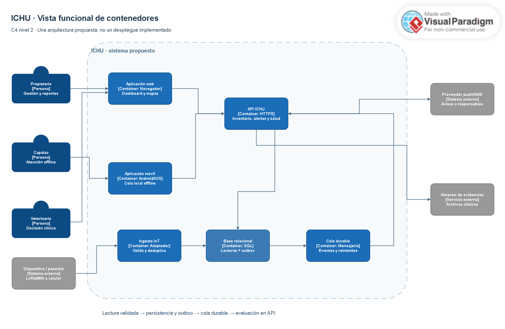
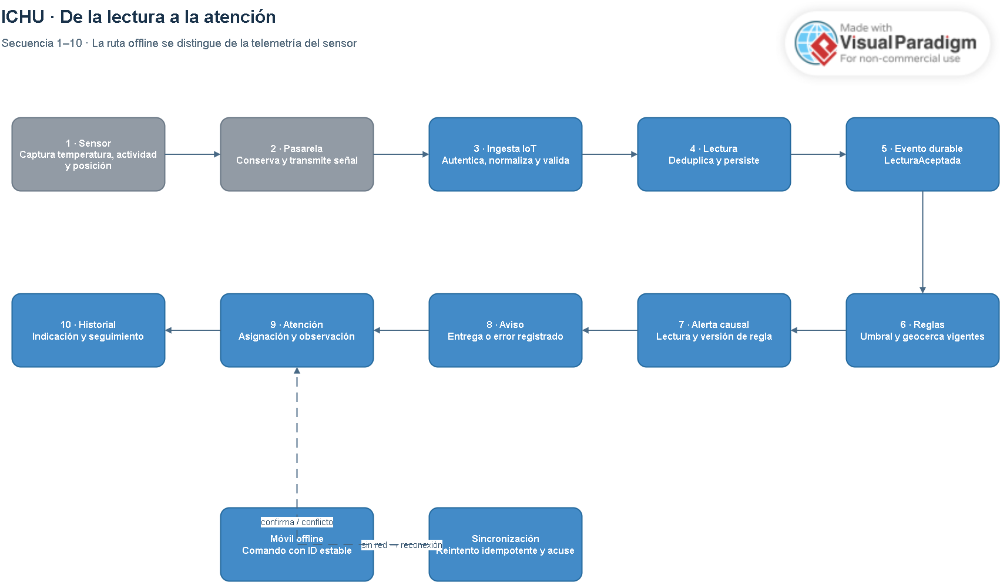
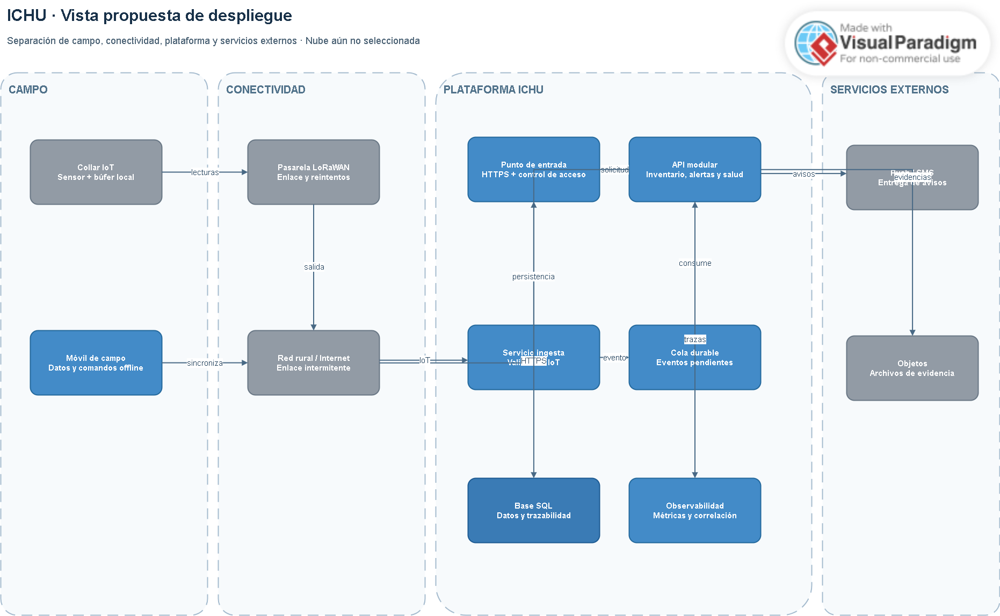
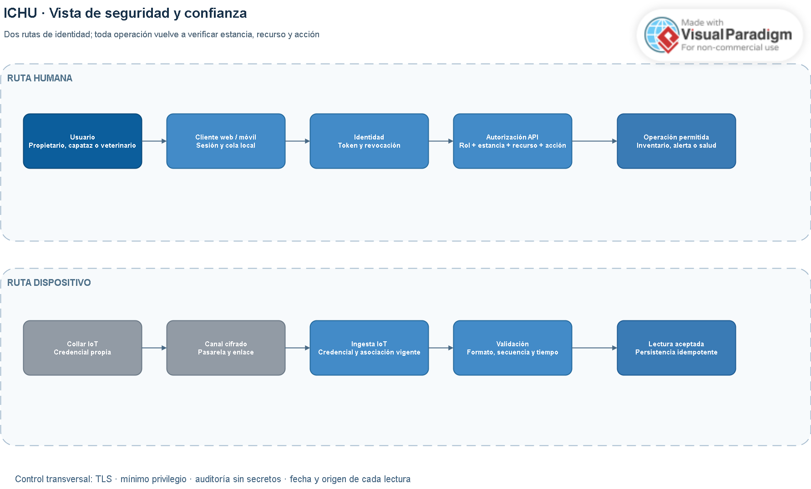
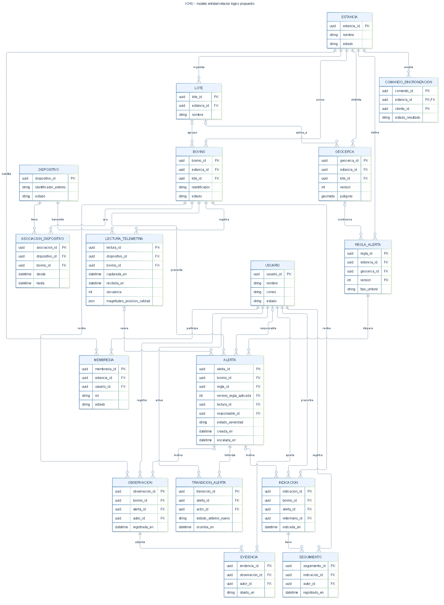

# Capítulo IV: Product Architecture Design

Este capítulo especifica la arquitectura propuesta para **ICHU**, la solución SmartFarm de monitoreo bovino. Las decisiones son de diseño para los siguientes avances; no se presentan como componentes ya implementados. La trazabilidad usa las entrevistas del capítulo II y las historias ICHU-US-01 a ICHU-US-22 del capítulo III. El MVP cubre inventario, dispositivos, telemetría, geocercas, alertas, atención en campo, operación offline e historial clínico.

## 4.1. Design Concepts, ViewPoints & ER Diagrams

Se detallan principios, estilos, límites, vistas y modelo de datos que guían el diseño. Los diagramas representan una arquitectura propuesta y se acompañan de criterios textuales para interpretar sus decisiones.

### 4.1.1. Principles Statements

| Principio | Aplicación | Verificación |
|---|---|---|
| Trazabilidad | Lectura, alerta, asignación, observación e indicación conservan enlaces causales, autor y fechas. | Reconstruir un caso desde la señal hasta el seguimiento clínico. |
| Continuidad | Dispositivo y móvil conservan datos pendientes y reintentan al recuperar red. | Una interrupción no pierde registros ni crea duplicados. |
| Acceso mínimo | El servidor verifica rol, estancia y recurso; dispositivos y personas usan credenciales separadas. | Denegar accesos entre estancias. |
| Responsabilidad única | Inventario, telemetría, alertas y salud tienen dueño lógico y contratos. | Ningún módulo escribe tablas privadas de otro. |
| Evidencia, no diagnóstico automático | La alerta ayuda al triaje; la decisión clínica corresponde al veterinario. | Interfaz distingue lectura, anomalía, observación y diagnóstico. |
| Evolución observable | Contratos versionados, identificadores de correlación y métricas de retraso/error. | Seguir una lectura desde el ingreso hasta el aviso. |

### 4.1.2. Approaches Statements: Architectural Styles & Patterns

Se propone una arquitectura **modular orientada a eventos** para telemetría y una **API HTTP** para consultas y comandos humanos. La carga de lecturas es diferente a la de altas de bovinos o diagnósticos; separar responsabilidades evita que una ráfaga de sensores bloquee la atención. En el MVP los módulos pueden compartir despliegue; su separación física se decidirá según carga y operación medidas.

El dispositivo registra temperatura, actividad y posición cuando dispone de los sensores correspondientes. Conserva lecturas durante una interrupción y las transmite por pasarela LoRaWAN o red celular. Un adaptador autentica y normaliza el mensaje. Telemetría valida, deduplica y persiste. El evento de lectura aceptada actualiza el último estado y activa reglas; la API sirve las vistas web y móvil. El móvil mantiene una cola local de comandos y la sincroniza al recuperar conexión.

La entrega de campo se considera **al menos una vez**. Identificadores estables hacen idempotentes los reintentos. Los cambios de estado de una alerta son transaccionales; el dashboard y las notificaciones pueden actualizarse de forma eventual y muestran la fecha del último dato.

### 4.1.3. Context Diagram

El límite de ICHU incluye clientes web/móvil, API, identidad, inventario, telemetría, alertas, salud y almacenamiento. Fuera del límite se ubican usuarios, dispositivos/pasarela, proveedor push/SMS y futuros sistemas clínicos externos.

*Figura 4.1. Diagrama de contexto de ICHU (C4, nivel 1). Elaboración propia en Visual Paradigm Online. La conexión con un sistema clínico externo representa una integración futura, no una función implementada en el MVP.*

| Actor externo | Envía a ICHU | Recibe de ICHU | Historias |
|---|---|---|---|
| Propietario/administrador | Altas, geocercas, asignaciones y reglas | Dashboard, mapa, alertas y reportes | ICHU-US-01 a 07, 20 a 22 |
| Capataz | Observaciones y confirmaciones, incluso offline | Incidencias, ubicación conocida y sincronización | ICHU-US-08 a 13, 17 |
| Veterinario | Diagnóstico, indicación y seguimiento | Series, historial y alertas por lote | ICHU-US-14 a 19 |
| Dispositivo/pasarela | Lectura, ID, hora y calidad de señal | Acuse técnico si el canal lo permite | ICHU-US-03, 05, 14, 20 |
| Proveedor push/SMS | Acuse o error de entrega | Solicitud de aviso referida a una alerta | ICHU-US-09, 22 |
| Sistema clínico externo | Solicitud autenticada | Datos permitidos y auditados | ICHU-US-19 |

Flujo de contexto: **dispositivo → pasarela/adaptador → telemetría → reglas → alerta → aviso → atención → historial**. Cada consulta muestra cuándo se capturó o actualizó el dato. La figura resume las relaciones externas; los componentes internos del flujo se detallan en las vistas de 4.1.4.

### 4.1.4. Approach Driven ViewPoints Diagrams

La **vista funcional de contenedores** (figura 4.2) descompone el límite de ICHU mostrado en la figura 4.1. Es un diseño propuesto: los nombres de tecnologías indican el tipo de interfaz o almacenamiento, no un proveedor ni un despliegue ya decidido. Los clientes web y móvil acceden a la API por HTTPS; el móvil conserva comandos pendientes y los sincroniza con identificadores idempotentes. La pasarela transmite lecturas al proceso de ingesta, que autentica, normaliza y deduplica. La ingesta guarda la lectura y el evento pendiente en una misma transacción; un despachador de *outbox* publica después el evento aceptado en la cola durable. La API consume el evento para aplicar reglas y actualizar alertas; consulta y modifica los datos relacionales, solicita avisos al proveedor externo y conserva referencias a archivos de evidencia. El servidor comprueba rol y pertenencia a estancia en cada operación.

*Figura 4.2. Vista de contenedores de ICHU (C4, nivel 2). Elaboración propia en Visual Paradigm. La flecha de base relacional a cola representa el despachador de outbox; los módulos indicados dentro de la API comparten un contenedor lógico en el MVP. [Abrir diagrama editable](https://online.visual-paradigm.com/w/sooshvme/diagrams/#diagram:workspace=sooshvme&proj=0&id=9&import=draw.io&type=BlockDiagram) · [Archivo fuente editable](images/CHAPTER04/container-view-vp.drawio).*

La **vista de flujo de datos** (figura 4.3) ordena la lectura en dos trayectos visuales: pasos 1–5 de izquierda a derecha y 6–10 de derecha a izquierda. La alerta registra qué lectura y versión de regla la originaron; la notificación y la intervención humana son posteriores. La franja inferior distingue los comandos capturados offline en el móvil de la telemetría enviada por el sensor.

*Figura 4.3. Flujo de datos de una alerta en ICHU. Elaboración propia en Visual Paradigm. [Abrir diagrama editable](https://online.visual-paradigm.com/w/sooshvme/diagrams/#diagram:workspace=sooshvme&proj=0&id=10&import=draw.io&type=BlockDiagram) · [Archivo fuente editable](images/CHAPTER04/data-flow-view-vp.drawio).*

La **vista de despliegue** (figura 4.4) separa campo, conectividad, plataforma y servicios externos. Se muestran procesos y almacenes lógicos, sin fijar aún una nube. Ante un corte de enlace, el dispositivo o el móvil conserva elementos pendientes y reintenta; la alerta persistida no depende de que el proveedor de avisos esté disponible.

*Figura 4.4. Vista de despliegue propuesta de ICHU. Elaboración propia en Visual Paradigm. [Abrir diagrama editable](https://online.visual-paradigm.com/w/sooshvme/diagrams/#diagram:workspace=sooshvme&proj=0&id=11&import=draw.io&type=BlockDiagram) · [Archivo fuente editable](images/CHAPTER04/deployment-view-vp.drawio).*

La **vista de seguridad** (figura 4.5) separa dos rutas de confianza: personas con sesión y roles, y dispositivos con credenciales propias. Una sesión válida no concede acceso indiscriminado: la API comprueba rol, estancia, recurso y acción. La ingesta IoT comprueba credencial, formato, secuencia y asociación vigente antes de aceptar una lectura. Ambos recorridos generan trazas de auditoría sin exponer secretos.

*Figura 4.5. Vista de seguridad de ICHU. Elaboración propia en Visual Paradigm. [Abrir diagrama editable](https://online.visual-paradigm.com/w/sooshvme/diagrams/#diagram:workspace=sooshvme&proj=0&id=12&import=draw.io&type=BlockDiagram) · [Archivo fuente editable](images/CHAPTER04/security-view-vp.drawio).*

| Vista | Elementos y relaciones representados | Pregunta |
|---|---|---|
| Funcional/contenedores (figura 4.2) | Actores, web, móvil, API modular, ingesta IoT, base SQL, cola durable, pasarela, proveedor de avisos y almacén de evidencias. Identidad, inventario, salud, geocercas y alertas son responsabilidades de la API. | ¿Quién responde por cada capacidad? |
| Flujo de datos (figura 4.3) | Captura, enlace rural, autenticación IoT, deduplicación, persistencia, evento durable, regla, alerta causal, aviso, atención e historial; ruta offline diferenciada. | ¿Cómo llega una señal a una alerta? |
| Despliegue (figura 4.4) | Dispositivo, móvil, redes, punto de entrada, API, ingesta, cola, base, observabilidad y servicios externos. | ¿Dónde se ejecuta y qué falla con la red? |
| Seguridad (figura 4.5) | Sesión humana, credencial IoT, autorización por rol/estancia/recurso, validación de lecturas y controles de auditoría y cifrado. | ¿Quién puede consultar o cambiar un dato? |

La secuencia de una alerta crítica es lectura aceptada → regla vigente → alerta con causa → solicitud de aviso → asignación → observación → indicación. La secuencia offline es comando local con ID estable → reconexión → autorización → aplicación idempotente → confirmación o conflicto. Las cuatro figuras son perspectivas complementarias del mismo diseño propuesto y no evidencia de implementación o pruebas ejecutadas.

### 4.1.5. Relational/Non Relational Database Diagram

Se propone una base relacional para integridad de asociaciones, permisos y estados. La telemetría se organiza por animal y tiempo, mediante particiones o almacenamiento especializado si el volumen medido lo requiere. Los archivos de evidencia se guardan en almacenamiento de objetos y la base conserva su referencia. No se fija un proveedor de nube antes de evaluar el despliegue.

*Figura 4.6. Diagrama entidad–relación lógico de ICHU. Elaboración propia. Las patas de cuervo indican multiplicidad y el círculo indica participación opcional. [Versión vectorial](images/CHAPTER04/erd-ichu.svg) · [Fuente editable Mermaid](images/CHAPTER04/erd-ichu.mmd).*

| Entidad lógica | Relaciones y reglas |
|---|---|
| Estancia, Usuario, Membresía | Membresía une usuario y estancia con rol. Toda consulta se filtra por estancia. |
| Lote, Bovino | Lote pertenece a estancia; bovino pertenece a estancia y a un lote opcional. Baja lógica para conservar historial. |
| Dispositivo, Asociación | Asociación une dispositivo y bovino por vigencia; se impiden vínculos activos incompatibles. |
| LecturaTelemetría | Referencia dispositivo y bovino válido al capturar; guarda horas de captura/recepción, magnitudes, posición y calidad. Clave de deduplicación por dispositivo y secuencia. |
| Geocerca, ReglaAlerta | Vinculadas a estancia/lote. Cada versión de regla es inmutable y se identifica por `(regla_id, version)`; la alerta conserva la versión aplicada. |
| Alerta, TransiciónAlerta | Alerta referencia bovino, versión de regla y lectura causal; registra creación, responsable actual y última escalada, cuando exista. Transición guarda estados anterior/nuevo, actor y hora. |
| Observación, Evidencia | Observación referencia bovino y opcionalmente alerta; evidencia conserva autor y localizador de archivo. |
| Indicación, Seguimiento | Referencian bovino, veterinario y alerta cuando corresponde; agregan historia sin sobrescribir registros previos. |
| ComandoSincronización | Clave única por estancia, cliente y comando; conserva respuesta para reintentos. |

**Reglas de integridad.** `Bovino.estancia_id` debe coincidir con la estancia del lote, cuando hay lote. Una lectura solo puede asociarse al bovino cuya asociación con el dispositivo estaba vigente en `capturada_en`; registra por separado `capturada_en` y `recibida_en`, y la clave `(dispositivo_id, secuencia)` evita duplicados. `Alerta.lectura_id`, `Alerta.responsable_id`, `Alerta.escalada_en`, `Observación.alerta_id` e `Indicación.alerta_id` pueden ser nulos según el caso; `Alerta.creada_en` es obligatoria. La referencia compuesta `(Alerta.regla_id, Alerta.version_regla_aplicada)` apunta a una fila inmutable de `ReglaAlerta(regla_id, version)` para reconstruir la regla que originó la alerta. `ComandoSincronización` tiene clave primaria compuesta `(estancia_id, cliente_id, comando_id)` y almacena el resultado de los reintentos. Los identificadores de responsable, autor y veterinario referencian `Usuario` y requieren una membresía vigente con el rol adecuado; el diagrama muestra esas referencias, pero la autorización se verifica además en la API.

Índices prioritarios: alertas por estancia/estado/severidad, lecturas por bovino/tiempo y deduplicación por dispositivo/secuencia. Retención y protección de evidencias se validarán antes de producción. El almacén de objetos no se representa como base no relacional: solo guarda archivos y devuelve un localizador persistido en `Evidencia.objeto_uri`. Tampoco se inventa una segunda base de datos sin una necesidad medida.

### 4.1.6. Design Patterns

| Patrón | Aplicación |
|---|---|
| Adaptador | Traduce LoRaWAN/celular a un contrato interno sin mezclar transporte con reglas clínicas. |
| Repositorio | Aísla persistencia de bovinos, alertas e indicaciones para probar el dominio. |
| Outbox | Persiste un cambio y el evento pendiente en la misma transacción local. |
| Idempotencia | Devuelve el mismo resultado al repetir una lectura o comando con ID estable. |
| Máquina de estados | Restringe alerta: nueva, reconocida, asignada, en atención y cerrada. |
| Estrategia de reglas | Evalúa umbrales y geocercas por tipo y versión. |
| Proyección de lectura | Prepara último estado y conteos sin alterar lecturas originales. |

### 4.1.7. Tactics

Las tácticas hacen verificables los atributos de calidad. Las cifras de 4.2.3 son **metas propuestas**, no resultados medidos.

| Atributo | Táctica | Prueba prevista |
|---|---|---|
| Disponibilidad | Cola durable, reintentos progresivos y aislamiento de mensajes fallidos. | Detener evaluador y comprobar reprocesamiento sin pérdida. |
| Rendimiento | Proyección de último estado, índices y evaluación asíncrona. | Medir alerta y consulta bajo carga representativa. |
| Offline | Cola local persistente, acuse por comando e IDs idempotentes. | Capturar sin red, reiniciar y sincronizar sin duplicados. |
| Seguridad | Cifrado en tránsito, credencial IoT separada, roles por estancia y auditoría. | Acceso cruzado y revocación de permisos. |
| Modificabilidad | Contratos versionados y módulos por responsabilidad. | Cambiar una regla sin modificar entrada IoT o móvil. |
| Observabilidad | Correlación y métricas de edad de lectura, cola, errores y avisos. | Seguir una lectura desde el dispositivo hasta la alerta. |
